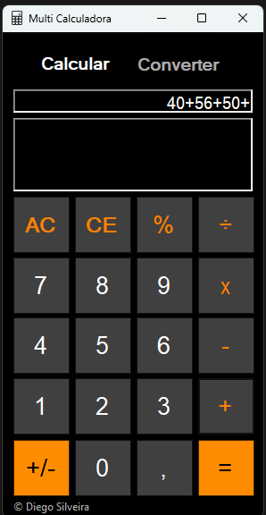
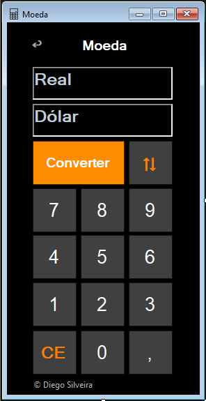
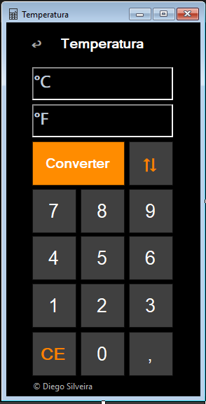

# 🧮 Multi-Calculadora

**Multi-Calculadora** é uma aplicação de desktop desenvolvida durante as aulas de programação com a professora Cláudia Werlich com **C# e Windows Forms**, que reúne várias funcionalidades úteis em uma única interface intuitiva e moderna.

## ✨ Funcionalidades

- 🧠 Calculadora básica: adição, subtração, multiplicação, divisão, porcentagem e inversão de sinal
- 🌡️ Conversor de temperatura: Celsius ↔ Fahrenheit
- 💰 Conversor de moeda: Real ↔ Dólar (com cotação atual via AwesomeAPI)
- 🕶️ Interface moderna com layout escuro e botões destacados
- Histórico simples de operações

## 📷 Pré-visualização

### 🧮 Tela Principal - Calculadora


### 💵 Conversor de Moeda


### 🌡️ Conversor de Temperatura


## 🛠️ Tecnologias Utilizadas

- `C#` com `.NET Framework`
- `Windows Forms`
- [`AwesomeAPI`](https://docs.awesomeapi.com.br/api-de-moedas) (para cotação do dólar)
- `Newtonsoft.Json` (para leitura de JSON)
- `DataTable.Compute` (para avaliar expressões matemáticas simples)

## ▶️ Como Executar

1. Clone o repositório:

```bash```
git clone https://github.com/diegosilveira94/multi-calculadora.git

2. Abra o projeto no Visual Studio.

3. Restaure os pacotes NuGet (principalmente Newtonsoft.Json).

4. Compile e execute a aplicação.

## 🚧 Possíveis Melhorias Futuras

- Suporte a outras moedas (ex: Euro, Libra, Iene)
- Suporte a teclado físico
- Histórico avançado de operações
- Temas customizáveis

## 📄 Licença

Este projeto está sob a licença MIT. Veja o arquivo [LICENSE](LICENSE) para mais detalhes.

---

Desenvolvido com 💻 por [Diego Silveira](https://github.com/diegosilveira94)

